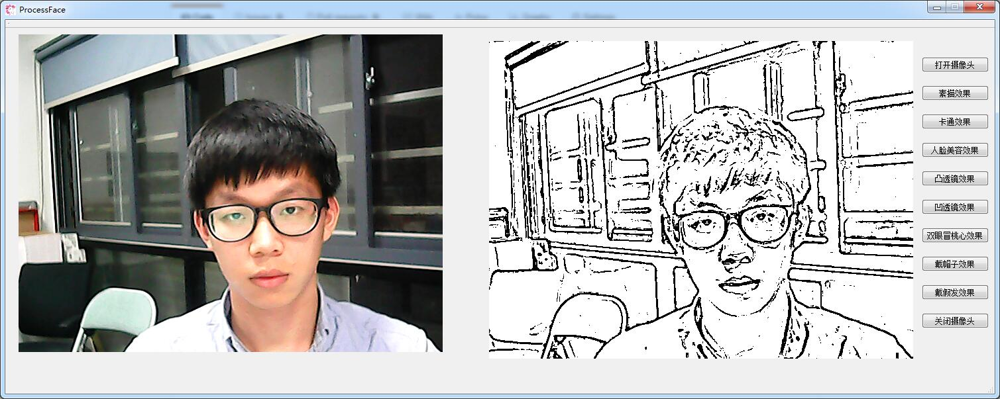
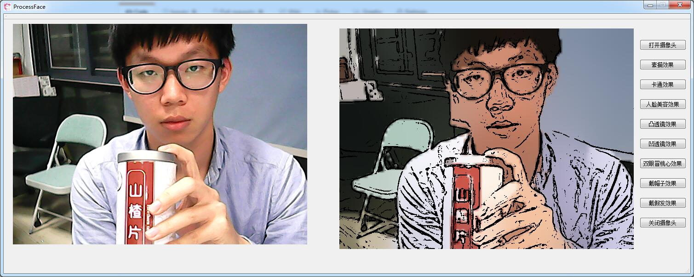
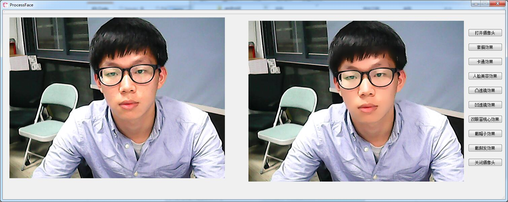
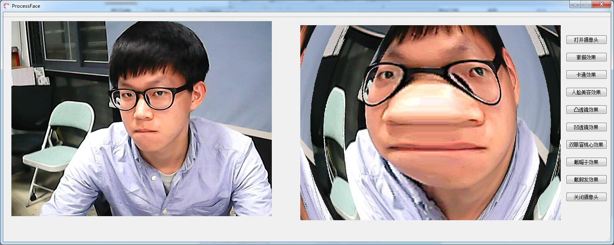
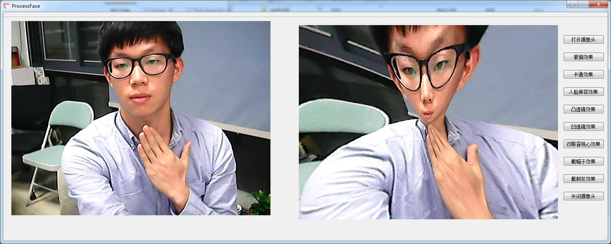
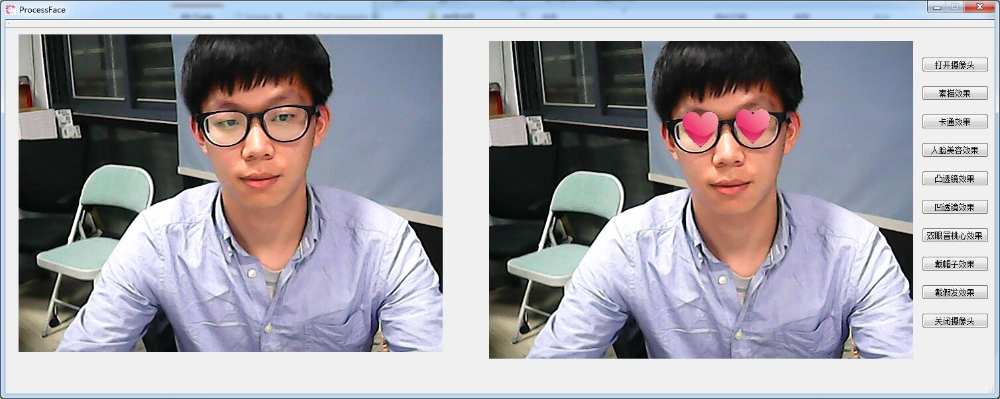
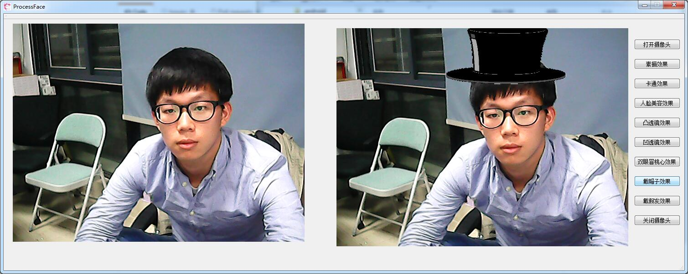
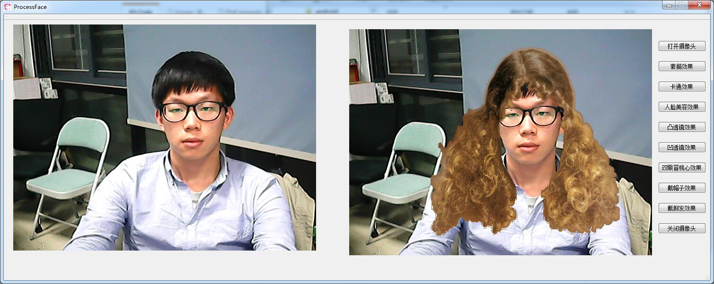

# “美团点评”杯厦门大学软件开发大赛

基于c++和opencv 的视频图像特效处理 
================================================
 
* 队伍名称：福鼎肉片队  
* 项目名称：视频图像特效  
* 团队队长：王兴  
* 团队成员：方媛  
* 项目简介：  
从摄像头视频中读取图像，加入特效处理后实时输出。  
实现的特效包括：   
  * 素描风格化   
  * 卡通风格化   
  * 人脸美容   
  * 凸透镜   
  * 凹透镜   
  * 眼冒桃心   
  * 戴帽子   
  * 戴假发   

magicface.exe    为可执行文件，可以直接运行。  
/ProcessFace/VideoEffects.cpp     为特效实现代码  
/ProcessFace/processface.cpp       为可视化界面代码  
